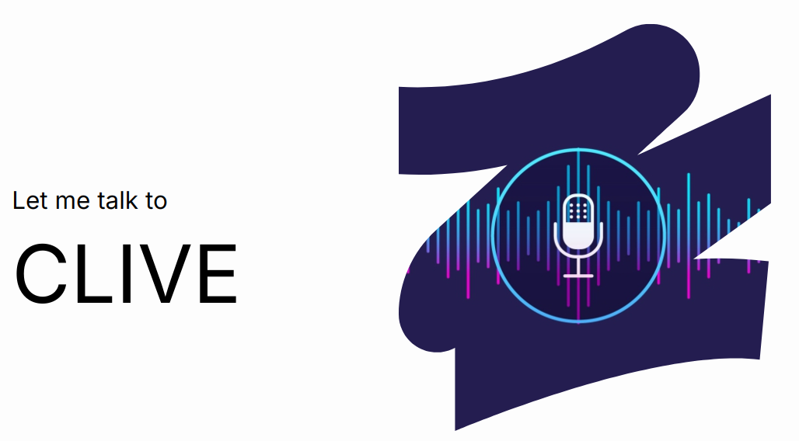

# CLIVE

This is the repository of team 8, that built CLIVE (Command LIne Voice-Enhanced). This has been built in ~30hrs during the Spotlight Consumer Edge AI Hackathon.

## Main components

The main function to be run for using CLIVE is `test_main.py`. Make sure to install all the required dependencies, and to have all files present from the GitHub repository. Make sure to also have a microphone to talk to CLIVE. Finally, you need an OpenAI key to run the pre-processing model (only run once). Enter it in the ``constants.py`` file.

Then, just follow CLIVE's prompts, and talk!

Feel free to explore all scripts, please be aware that it might not be fully cleaned as this is still work in progress.

## Contributors

This project was done by Anaïs Bayani, Agathe Coutaux, Isaline Goudeau, Baptiste Moalic & Anicet Nougaret.